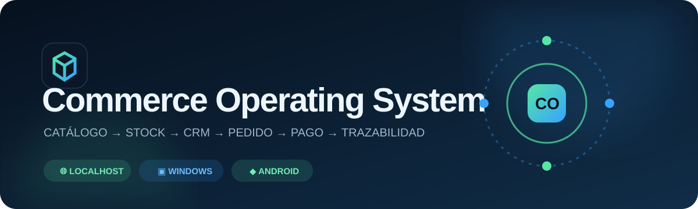
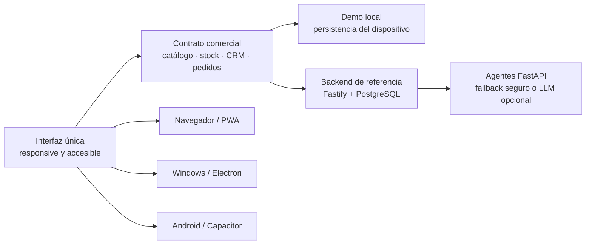

<div align="center">



# Commerce Operating System

## **Una operación comercial, tres superficies**

**Plataforma modular para recorrer catálogo → inventario → CRM → pedido → pago → documento tributario → operación asistida. La misma experiencia funciona como demo local en el navegador, aplicación portable de Windows y APK de Android; el backend de referencia añade Fastify, PostgreSQL y agentes FastAPI.**

[](https://github.com/vladimiracunadev-create/commerce-operating-system/actions/workflows/ci.yml)
[](https://github.com/vladimiracunadev-create/commerce-operating-system/actions/workflows/release.yml)


[Inicio rápido](docs/QUICKSTART.md) · [Guion de demo](docs/DEMO.md) · [Apoyo para reunión](docs/REUNION_FARMACIA_2026-09-10.md) · [Estado verificable](docs/STATUS.md) · [Plataformas](docs/PLATFORMS.md) · [Instancias tecnológicas](docs/TECHNOLOGY-INSTANCES.md) · [Arquitectura](docs/ARCHITECTURE.md) · [Seguridad](SECURITY.md)

| Flujo funcional | Motores de datos | Superficies | Acciones externas |
|:---:|:---:|:---:|:---:|
| **6 pasos principales** | **2** | **3** | **0 sin aprobación** |

</div>

> [!IMPORTANT]
> Pagos, documentos tributarios y propuestas de IA son **simulados**. El demo no mueve dinero, no emite ante el SII y no publica campañas. Los conectores reales son contratos de integración, no funcionalidades implícitas.

> [!TIP]
> Para la reunión con la farmacia, la guía canónica es [Reunión farmacia — demo conceptual](docs/REUNION_FARMACIA_2026-09-10.md): usa la demo local como recorrido principal de 3 a 5 minutos. Docker sirve para validación técnica previa o respaldo opcional, no como requisito de la presentación.

La presentación pública del producto y una copia ejecutable de la demo están disponibles en [GitHub Pages](https://vladimiracunadev-create.github.io/commerce-operating-system/).

## Qué funciona hoy

La versión `0.3.0` presenta el recorrido conceptual en seis pestañas autoexplicativas, con una sola tarea visible por vez:

1. crea un producto con SKU y precio;
2. recibe unidades en bodega;
3. registra un cliente y su consentimiento;
4. crea un pedido y reserva stock;
5. aprueba un pago mock y descuenta inventario;
6. explica el resultado mediante una trazabilidad visible.

Cada pestaña explica qué demuestra el concepto y qué continúa pendiente de la Fase 1. La boleta mock y los agentes permanecen disponibles como funciones secundarias, claramente simuladas y sujetas a sus controles. Cada cambio aplica permisos por rol y registra un evento. La demo local persiste en el dispositivo; el modo servidor usa PostgreSQL como fuente de verdad.

## Demo conceptual verificada


Las capturas son generadas por `pnpm test:web` después de cargar la aplicación en Chromium/Electron. El smoke test abre las seis pestañas, comprueba que solo una esté visible y recorre catálogo, inventario, cliente, pedido, pago mock, documento mock, trazabilidad y rechazo por rol.

## Ejecutar en 60 segundos

### Demo local — sin Docker ni base de datos

```bash
corepack pnpm install --frozen-lockfile
corepack pnpm demo:local
```

Abre [http://localhost:4173](http://localhost:4173). El estado se guarda en el almacenamiento local del navegador.

### Stack de referencia — API + PostgreSQL + agentes

Este perfil es opcional para la reunión. Úsalo antes de presentar para validar la arquitectura o durante la conversación solo si el cliente pregunta por el backend.

```bash
docker compose up --build
```

Abre [http://localhost:8080](http://localhost:8080). Salud: `/health`; disponibilidad de base de datos: `/ready`; agentes: `http://localhost:8100/health`.

### Windows

```powershell
corepack pnpm install --frozen-lockfile
corepack pnpm desktop
```

Para generar el ejecutable portable:

```powershell
corepack pnpm desktop:pack
```

El artefacto queda en `dist/installers/CommerceOS-Demo-Windows-0.3.0.exe`.

### Android

```bash
corepack pnpm install --frozen-lockfile
corepack pnpm android:sync
cd android
./gradlew assembleDebug
```

El APK queda en `android/app/build/outputs/apk/debug/app-debug.apk`. Requiere Android Studio/SDK y Java 21; el workflow de release prepara ese entorno automáticamente.

## Dos modos, un contrato funcional



| Perfil | Persistencia | Uso recomendado | Dependencias externas |
|---|---|---|---|
| **Demo local** | `localStorage` / WebView | presentación, evaluación, uso offline | ninguna |
| **Servidor de referencia** | PostgreSQL 16 | integración, API, prueba multiusuario | Docker Compose |

## Roles demostrables

| Rol | Capacidades |
|---|---|
| Administrador | todas las capacidades y restablecimiento |
| Bodega | recepción de stock |
| Ventas | clientes, pedidos y pagos |
| Contador | documento tributario mock |
| Marketing / Operador IA | propuestas de agentes |
| Auditor | lectura del estado y eventos |

El encabezado `x-demo-role` existe solo para demostrar RBAC. Producción requiere identidad real mediante OIDC, sesiones seguras y autorización por tenant.

## Estado verificable

| Componente | Estado |
|---|---|
| Demo local en `localhost` | ✅ flujo completo y persistencia local |
| API Fastify | ✅ catálogo, inventario, CRM, pedidos, pagos, boleta, reset y salud |
| PostgreSQL | ✅ esquema versionado y volumen separado |
| Agentes | ✅ cinco especialidades con fallback determinista |
| Windows | ✅ shell Electron y empaquetado portable automatizado |
| Android | ✅ shell Capacitor y APK debug automatizado |
| Pagos reales | ⚪ contrato documentado; no conectado |
| Emisión SII real | ⚪ contrato documentado; requiere proveedor/certificación |
| Autenticación de producción | ⚪ fuera del demo actual |

La evidencia exacta y las limitaciones viven en [docs/STATUS.md](docs/STATUS.md).

## Instancias tecnológicas

El producto se define por contratos, invariantes y eventos, no por un framework. La implementación actual es la **instancia de referencia**; [docs/TECHNOLOGY-INSTANCES.md](docs/TECHNOLOGY-INSTANCES.md) especifica cómo portar una superficie a React, Flutter, .NET, Spring, FastAPI o Go sin cambiar el comportamiento esperado.

La regla es explícita: una tecnología se marca como `operativa` solo cuando pasa el mismo recorrido y sus verificaciones. Todo lo demás aparece como `documentado` o `planeado`.

## Estructura

```text
apps/
├─ api/            # API Fastify + TypeScript
├─ desktop/        # shell Windows Electron
└─ web/            # interfaz compartida, PWA y bundle móvil
android/           # proyecto Android generado por Capacitor
packages/
├─ demo-core/      # invariantes del demo local
└─ contracts/      # eventos del dominio
services/agents/   # agentes FastAPI, LLM opcional
infra/sql/         # esquema PostgreSQL
docs/              # producto, demo, plataformas y arquitectura
.github/workflows/ # CI y empaquetado de releases
```

## Comandos de ingeniería

| Comando | Resultado |
|---|---|
| `pnpm demo:local` | demo en `127.0.0.1:4173` |
| `pnpm test` | 11 pruebas de núcleo, presentación, documentación y Pages |
| `pnpm build:api` | compilación estricta TypeScript |
| `pnpm check` | núcleo, API, documentación y sincronía del bundle |
| `pnpm desktop` | aplicación Windows en modo desarrollo |
| `pnpm desktop:pack` | `.exe` portable |
| `pnpm android:sync` | sincroniza la interfaz con Android |

## Seguridad y límites

- `.env` y secretos locales están excluidos; `.env.example` solo contiene nombres y valores de demostración.
- Los agentes nunca publican ni escriben fuera del sistema sin aprobación humana.
- Electron usa aislamiento de contexto, sandbox y `nodeIntegration: false`.
- La demo no debe almacenar datos personales reales.
- La API de demostración no debe exponerse directamente a internet.

Consulta [SECURITY.md](SECURITY.md) antes de conectar proveedores reales.

## Documentación

| Documento | Para qué sirve |
|---|---|
| [Sitio del producto](https://vladimiracunadev-create.github.io/commerce-operating-system/) | explicación pública, demo web y descargas verificadas |
| [Guía canónica de la reunión](docs/REUNION_FARMACIA_2026-09-10.md) | recorrido comercial de 3–5 minutos, mensajes, preguntas y Plan B |
| [Inicio rápido](docs/QUICKSTART.md) | elegir y levantar una superficie |
| [Guion de demo](docs/DEMO.md) | probar el recorrido paso a paso |
| [Estado](docs/STATUS.md) | separar operativo, simulado y pendiente |
| [Plataformas](docs/PLATFORMS.md) | requisitos de navegador, Windows y Android |
| [Instancias tecnológicas](docs/TECHNOLOGY-INSTANCES.md) | portar el producto sin cambiar el contrato |
| [Arquitectura](docs/ARCHITECTURE.md) | límites, flujos y decisiones |
| [Integraciones](docs/INTEGRATIONS.md) | contratos para pagos, DTE y canales |
| [Roles y agentes](docs/ROLES_AND_AGENTS.md) | permisos y guardrails humanos |
| [Changelog](CHANGELOG.md) | evolución por versión |

## Licencia

[MIT](LICENSE) · Vladimir Acuña.
