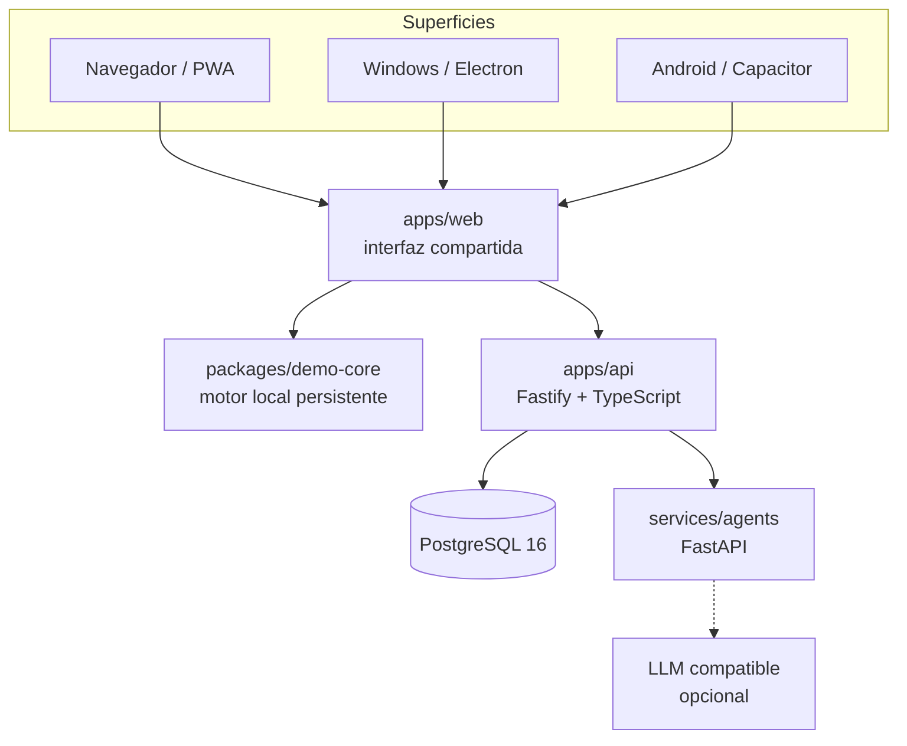

# Arquitectura

## Objetivo

Mantener el núcleo comercial independiente del canal y del proveedor. Navegador, Windows y Android recorren el mismo producto; el motor local permite demostrarlo sin infraestructura y la API de referencia prueba el camino con PostgreSQL.

## Vista de contenedores

## Perfiles de ejecución

### Demo local

El cliente ejecuta las invariantes en el dispositivo y persiste un estado de demostración. Sirve para presentaciones, trabajo offline y empaquetado. No pretende resolver concurrencia ni operación multiusuario.

### Servidor de referencia

Fastify aplica el mismo recorrido sobre PostgreSQL. Los pedidos reservan stock y los pagos descuentan unidades dentro de transacciones. Los eventos quedan en una tabla outbox; su procesamiento asíncrono pertenece a una etapa posterior.

## Módulos de dominio

1. Identidad y roles.
2. Catálogo/PIM.
3. Compras y proveedores.
4. Inventario/WMS.
5. CRM y consentimiento.
6. Ventas/OMS.
7. Pagos mediante adaptadores.
8. Tributación y contabilidad mediante adaptadores.
9. Fulfilment y transporte.
10. Marketing y promociones.
11. B2B y partners.
12. Operación asistida por agentes.
13. Hub de integraciones.
14. Auditoría y observabilidad.

La demo `0.3.0` implementa un corte vertical de los módulos 1, 2, 4, 5, 6, 7, 8, 12 y 14. Los demás son límites arquitectónicos, no funcionalidades terminadas. La interfaz presenta ese corte en seis pestañas guiadas; esta organización visual no amplía el alcance funcional.

## Invariantes del corte vertical

- un SKU es único dentro de la compañía;
- la disponibilidad es `cantidad - reservado`;
- un pedido no reserva más unidades que las disponibles;
- un pago aprobado descuenta cantidad y libera la reserva;
- un documento tributario mock exige un pedido pagado y es único;
- cada transición emite un evento;
- un agente propone, pero no ejecuta escrituras externas.

## Fuente de verdad

PostgreSQL es la fuente de verdad del perfil servidor. La persistencia local es una fuente de verdad deliberadamente aislada para cada instalación demo; no se sincroniza de forma automática con el servidor.

## Seguridad por superficie

- **Web:** CSP, sin secretos embebidos, rutas API explícitas.
- **Windows:** sandbox Electron, aislamiento de contexto y Node deshabilitado.
- **Android:** activos locales; conexión a servidor solo por URL configurada.
- **API:** validación de entradas y RBAC demostrativo; autenticación real pendiente.
- **Agentes:** fallback determinista, sin escrituras externas y aprobación humana obligatoria.

## Camino de evolución

1. **Demo consolidada:** tres superficies, mocks, CI y contratos.
2. **Piloto controlado:** OIDC, tenants, migraciones, idempotencia, workers y observabilidad.
3. **Integraciones reales:** un proveedor de pago, uno de DTE y uno de fulfilment, con webhooks firmados.
4. **Operación:** backups, recuperación, SLO, alertas, soporte y firma de artefactos.
5. **Escala:** separar servicios solo cuando carga, ownership o aislamiento lo justifiquen.

## Decisión de portabilidad

Las alternativas tecnológicas viven en [TECHNOLOGY-INSTANCES.md](TECHNOLOGY-INSTANCES.md). Una reimplementación debe pasar el contrato de paridad antes de reemplazar la instancia de referencia.
