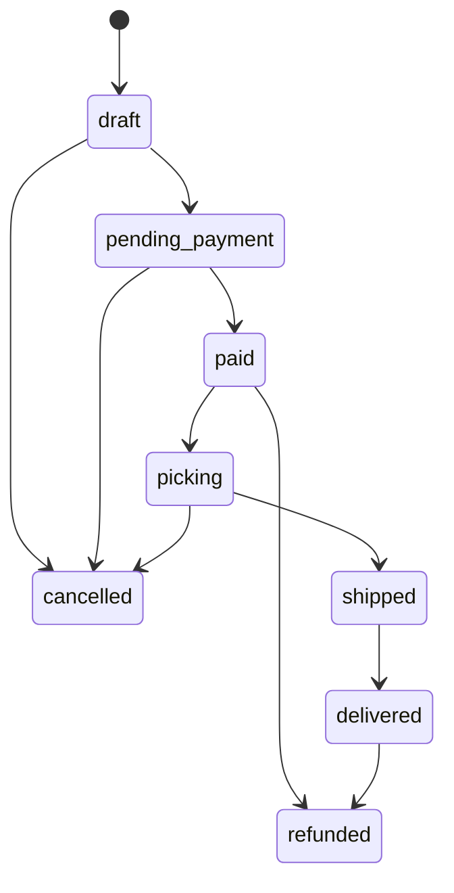

# Modelo de dominio actual

Fecha de verificación: 10 de septiembre de 2026.

## Agregados del corte vertical

- **Producto:** SKU, nombre, descripción y precio entero en centavos.
- **Inventario:** saldo físico y reservado por producto y bodega.
- **Cliente:** identidad comercial mínima y consentimiento booleano.
- **Pedido:** cliente, líneas, importes y estado.
- **Pago mock:** aprobación simulada asociada al pedido.
- **Documento tributario mock:** boleta demostrativa única por pedido.

## Máquina de estados del pedido

`cancelled` y `refunded` son terminales. La matriz completa, incluidas las transiciones rechazadas, se prueba en `apps/api/test/domain.test.ts`.

## Contrato de errores

Los casos de uso lanzan errores de dominio con código estable y estado HTTP. El borde HTTP responde `application/problem+json` con `type`, `title`, `status`, `detail`, `instance`, `code` y `correlation_id`. Los errores inesperados no exponen detalles internos.

## Contrato de eventos v1

Cada evento incluye `event_id`, `event_type`, agregado, `tenant_id`, `actor_id`, `correlation_id`, `causation_id`, `version`, fecha y payload. El adaptador PostgreSQL guarda esos metadatos en `outbox_events`; su entrega asíncrona todavía no está implementada.
