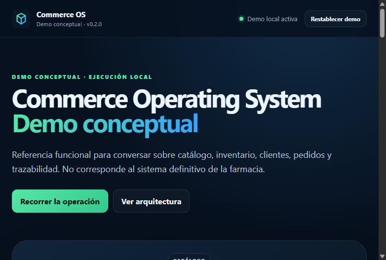

# Reunión farmacia — demo conceptual

Fecha: 10 de septiembre de 2026, 12:00

Duración recomendada de la demo: 3 a 5 minutos.

Este documento es la **guía canónica de la reunión**. Si otro documento resume el recorrido de forma diferente, prevalece esta guía.

## Orden de preferencia

1. **Principal — Demo local:** usar `http://127.0.0.1:4173`; no requiere Docker, red ni base de datos.
2. **Respaldo visual:** usar las capturas incluidas en este documento si la interfaz no puede abrirse.
3. **Opcional — Docker:** utilizarlo para una validación técnica previa o si el cliente pregunta por API, PostgreSQL o agentes. No forma parte del recorrido comercial de 3 a 5 minutos.

Página pública de apoyo: <https://vladimiracunadev-create.github.io/commerce-operating-system/>. Incluye explicación del producto, una copia web ejecutable, capturas y enlaces a las descargas de `v0.3.0`.

## A. Qué es la demo

Commerce Operating System es un laboratorio tecnológico propio utilizado para demostrar conceptos de operación comercial.

No es el sistema definitivo de la farmacia. No define la arquitectura final y no significa que los requerimientos del cliente ya estén levantados.

## B. Qué demuestra

- catálogo;
- inventario;
- CRM básico;
- pedidos;
- reserva y descuento de stock;
- pago simulado;
- documento tributario simulado;
- roles;
- trazabilidad;
- ejecución local.

## C. Qué no demuestra

- Webpay real;
- SII real;
- ERP de la farmacia;
- preparados magistrales;
- recetas;
- multisucursal real;
- autenticación productiva;
- infraestructura definitiva;
- cumplimiento sanitario validado;
- solución final del cliente.

## D. Frase de apertura

> “Quiero mostrarles algo muy breve sólo como referencia. Este no es el sistema de la farmacia ni una definición de cómo deberá quedar. Es un laboratorio tecnológico propio que nos permite visualizar algunos conceptos de comercio, como catálogo, inventario, clientes, pedidos y trazabilidad. La Fase 1 es precisamente la que permitirá transformar estos conceptos en los procesos reales de sus tres sucursales, su ERP y su operación.”

## Recorrido de 3 a 5 minutos

1. Ejecutar `corepack pnpm demo:check`.
2. Abrir `http://127.0.0.1:4173`.
3. Mantener cerradas **Opciones de demostración** y **Capacidades técnicas secundarias**. El modo local y el perfil Administrador son los valores iniciales.
4. Pulsar **Restablecer demo** y confirmar.
5. En la pestaña **Catálogo**, explicar qué se vende y guardar el producto ficticio.
6. Avanzar a **Inventario**, relacionar el producto e ingresar las unidades ficticias.
7. Avanzar a **Cliente** y registrar **Cliente Demostración**.
8. Avanzar a **Pedido**, crear una unidad y explicar la reserva de stock.
9. Avanzar a **Pago simulado**, leer la advertencia **PAGO SIMULADO** y aprobar el mock.
10. Emitir la boleta mock solo si aporta a la conversación, leyendo **DOCUMENTO TRIBUTARIO SIMULADO**.
11. Avanzar a **Trazabilidad** y cerrar reconstruyendo la secuencia de eventos.

La navegación principal admite clic y teclado: flechas izquierda/derecha cambian de pestaña; `Inicio` y `Fin` llevan al primer o último paso. Mostrar una sola pestaña por vez evita convertir la reunión en una enumeración de acciones.

No mostrar agentes, API, arquitectura, roles ni otras superficies salvo pregunta directa.

## Capturas de respaldo




Estas capturas son generadas por `corepack pnpm test:web` después de ejecutar el recorrido en Chromium/Electron; no son maquetas dibujadas.

## Mensajes que deben quedar explícitos

- **PAGO SIMULADO:** No mueve dinero ni utiliza Webpay real.
- **DOCUMENTO TRIBUTARIO SIMULADO:** No emite documentos ante el SII.
- **ERP:** pendiente de levantamiento e integración durante Fase 1.
- **Preparados magistrales:** pendiente de levantamiento funcional con el cliente y químico farmacéutico.
- **MULTISUCURSAL:** pendiente de levantamiento con el cliente.

Todos los datos de la demo son ficticios. No ingresar RUT, pacientes, recetas, correos, teléfonos, credenciales ni datos médicos reales.

## Preguntas para devolver al cliente

- ¿Qué ERP utiliza hoy cada sucursal y quién administra su integración?
- ¿Cómo se actualizan actualmente catálogo, precios y stock?
- ¿Qué diferencias operacionales existen entre las tres sucursales?
- ¿Qué roles intervienen desde la venta hasta la entrega?
- ¿Qué procesos requieren validación del químico farmacéutico?
- ¿Qué información y responsables estarán disponibles durante la Fase 1?

## PLAN B

Si el recorrido presenta un problema, recargar la página y pulsar **Restablecer demo**. Si la página quedó en modo API, abrir **Opciones de demostración** y elegir **Demo local**. Si el problema continúa, apoyar la conversación con las capturas anteriores. La reunión debe continuar centrada en el levantamiento, no en reparar la aplicación.

## Validación Docker opcional — antes de la reunión

Docker no es necesario para presentar. Si se desea validar el backend de referencia antes de comenzar:

```bash
docker compose up -d --build
node scripts/smoke-api.mjs
```

Resultado esperado: API activa, PostgreSQL `ready`, pedido `paid`, pago `approved`, documento mock `issued` y agente `safe-fallback`. Mantener los puertos en una red de confianza; no exponer esta demo directamente a internet.

## E. Frase de cierre

> “Lo importante de esta demo no es copiar este sistema. Es visualizar conceptos. La Fase 1 permitirá determinar cuáles aplican realmente a la farmacia, cuáles deben cambiar y cuáles no corresponden.”

## Preflight del expositor

```bash
corepack pnpm install --frozen-lockfile
corepack pnpm demo:check
corepack pnpm demo:local
```

- equipo conectado a energía;
- navegador abierto en `http://127.0.0.1:4173`;
- modo local seleccionado;
- datos restablecidos;
- pestaña **Catálogo** seleccionada;
- zoom y resolución legibles;
- capturas disponibles sin conexión;
- notificaciones del sistema silenciadas.
