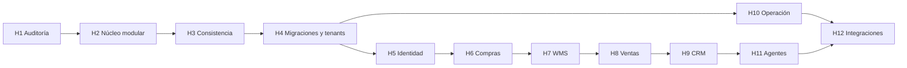

# Roadmap verificable de Commerce OS

Fecha de revisión: 10 de septiembre de 2026  
Punto de partida: `v0.3.0`

## Principios de ejecución

1. Un hito termina verticalmente antes de comenzar el siguiente.
2. `main` debe conservar la demo, pruebas y artefactos existentes.
3. El núcleo continúa como monolito modular Fastify + TypeScript + PostgreSQL.
4. Demo local y perfil servidor siguen separados; no se inventa sincronización.
5. Ninguna capacidad pasa a “operativa” sin implementación, prueba reproducible y límites documentados.
6. Pagos, DTE/SII y acciones externas permanecen simulados hasta contar con proveedor, credenciales seguras y validación específica.
7. Toda migración será aditiva o tendrá transición, respaldo y rollback compatible.

## Hitos

### Hito 1 — Auditoría, línea base y mapa ERP

Estado: **completado**.

Entregables:

- `docs/AUDIT-ERP-GAP.md`;
- `docs/ERP-CAPABILITY-MAP.md`;
- este roadmap;
- línea base local/remota y riesgos priorizados.

Criterios de salida:

- [x] estado e historial Git inspeccionados antes de editar;
- [x] 11/11 pruebas, API build y `DEMO READY`;
- [x] smoke UI y smoke API/Compose exitosos;
- [x] EXE portable construido y verificado;
- [x] CI, Pages y Release remotos contrastados;
- [x] versión, tests, workflows, Actions, About, release y encoding auditados;
- [x] brechas de dominio, seguridad, operación y plataforma priorizadas;
- [ ] APK local reproducido; bloqueado en este host por Android SDK ausente (CI/release sí aportan evidencia).

### Hito 2 — Núcleo modular y máquina de estados

Objetivo: extraer reglas desde `server.ts` sin cambiar Fastify ni romper la demo.

Estado: **completado el 10 de septiembre de 2026**.

Alcance propuesto:

- resolver la vulnerabilidad alta aplicable de `@fastify/static` con verificación de compatibilidad;
- introducir errores de dominio y contrato HTTP consistente;
- separar rutas, casos de uso, dominio, repositorios e infraestructura;
- centralizar transiciones de pedido;
- definir eventos versionados con actor, tenant, correlación y causación;
- crear pruebas unitarias del dominio y contrato de paridad local/API.

Criterios de salida:

- [x] todas las transiciones permitidas/rechazadas están enumeradas y probadas;
- [x] rutas HTTP, aplicación, dominio e infraestructura están separadas y el SQL queda en el repositorio PostgreSQL;
- [x] suite ampliada a 17/17 pruebas, build TypeScript y `DEMO READY`;
- [x] `@fastify/static` actualizado a `10.1.2`; `pnpm audit --audit-level high` no reporta vulnerabilidades altas;
- [x] errores HTTP usan `application/problem+json` sin filtrar fallos internos;
- [x] eventos v1 incluyen actor, tenant, correlación y causación;
- [x] arquitectura, modelo de dominio, mapa de capacidades y changelog actualizados.

### Hito 3 — Idempotencia, reservas y consistencia transaccional

Objetivo: garantizar efectos exactamente una vez dentro de las capacidades mock actuales.

Estado: **completado el 10 de septiembre de 2026**.

Alcance propuesto:

- pago idempotente por clave;
- operación comercial y evento en una sola transacción;
- constraints de stock y optimistic locking donde aporte valor;
- cancelación/expiración con liberación única;
- emisión mock concurrente con resultado determinista;
- pruebas PostgreSQL de concurrencia, rollback y doble solicitud.

Criterios de salida:

- [x] la misma clave de pago devuelve el mismo resultado aun bajo carrera; reutilizarla en otro pedido se rechaza;
- [x] bloqueos de fila y advisory lock impiden doble descuento, doble liberación y doble documento;
- [x] operación comercial y evento comparten transacción; un trigger de prueba demuestra el rollback integral;
- [x] cancelación y expiración liberan la reserva exactamente una vez;
- [x] constraints PostgreSQL impiden cantidad/reserva negativas y reserva superior al saldo;
- [x] `scripts/consistency-api.mjs` ejecuta el gate PostgreSQL en local y CI.

### Hito 4 — Migraciones y multiempresa

Objetivo: retirar constantes globales y convertir el esquema inicial en evolución repetible.

Alcance propuesto:

- ADR y herramienta de migraciones SQL explícitas;
- tenants, membresías, almacenes y relaciones reforzadas;
- seed demo separado;
- índices, timestamps y pruebas forward/rollback;
- evaluación de RLS como defensa adicional.

Criterios de salida:

- dos tenants no pueden leer ni modificar datos cruzados;
- instalación vacía y actualización desde `0.3.0` están probadas;
- rollback compatible documentado y ejecutado en entorno desechable.

### Hito 5 — Identidad y permisos de servidor

Objetivo: reemplazar `x-demo-role` fuera del modo demo.

Alcance propuesto: OIDC/OAuth 2.1, sesión/token seguro, permisos persistidos, autorización en cada endpoint, auditoría de acceso, CORS/rate limiting/cabeceras y ciclo de consentimiento.

Criterios de salida: identidad demo claramente separada, pruebas por permiso y tenant, expiración/rotación y errores sin filtración.

### Hito 6 — Compras y proveedores

Objetivo: primer corte ERP nuevo y completo.

Flujo: `proveedor → orden de compra → recepción parcial/total → movimiento de stock`.

Criterios de salida: UI mínima, API, migración, permisos, eventos, auditoría, costo unitario, cancelación, datos demo y pruebas end-to-end.

### Hito 7 — Inventario/WMS básico

Objetivo: ledger de movimientos, múltiples bodegas/ubicaciones, transferencias, ajustes aprobados, mínimos y kardex.

Lotes/series/vencimiento requieren decisión modular y levantamiento; no implican cumplimiento farmacéutico.

### Hito 8 — Ventas/OMS ampliado

Objetivo: cotizaciones, múltiples líneas, precios/descuntos vigentes, impuestos configurables, preparación/entrega, devoluciones y reembolsos mock.

### Hito 9 — CRM y consentimiento

Objetivo: contactos/organizaciones, oportunidades, actividades, deduplicación controlada, segmentación consentida y exportación/eliminación auditadas.

### Hito 10 — Outbox, observabilidad y recuperación

Objetivo: worker con reintentos/dead-letter, logs correlacionados y redactados, métricas/trazas/SLO, runbooks y backup con restauración demostrada.

### Hito 11 — Agentes gobernados y evaluables

Objetivo: contratos versionados, mínimo contexto, protección frente a prompt injection, métricas/costo, fallback, evaluaciones y aprobación persistida.

### Hito 12 — Integraciones reales seleccionadas

Objetivo: integrar solo proveedores explícitamente elegidos y autorizados, empezando en sandbox.

Gate obligatorio: idempotencia, webhooks firmados, replay protection, conciliación, secretos, observabilidad, rollback y aprobación humana. DTE/SII requiere además proveedor/certificación y validación profesional.

## Dependencias entre hitos

## Gate común por incremento

- comportamiento vertical implementado, no solo tablas o documentación;
- invariantes, autorización y aislamiento probados;
- migración y rollback definidos cuando cambien datos;
- evento/auditoría con payload sanitizado;
- interfaz usable y accesible cuando aplique;
- `pnpm check`, `pnpm demo:check`, pruebas PostgreSQL y builds aplicables;
- Docker Compose desde cero cuando cambien backend/datos;
- README, `docs/STATUS.md`, arquitectura, mapa y changelog reconciliados;
- workflows aplicables verdes, sin secretos ni binarios grandes versionados.

## Próxima decisión

Los hitos 2 y 3 están cerrados. El siguiente trabajo autorizado debe comenzar por el Hito 4: runner de migraciones, aislamiento multiempresa y actualización probada desde `0.3.0`.
